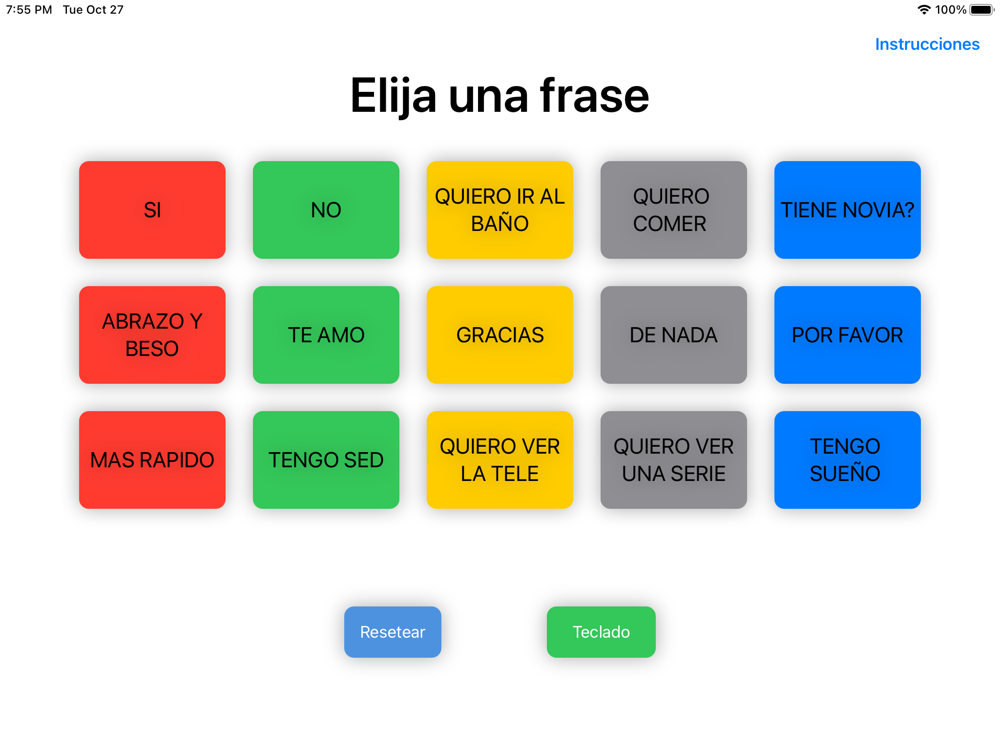
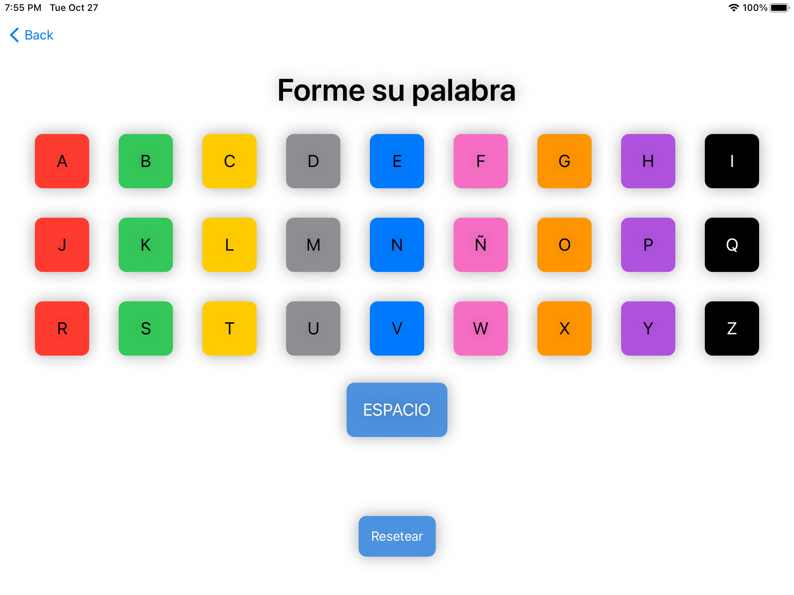
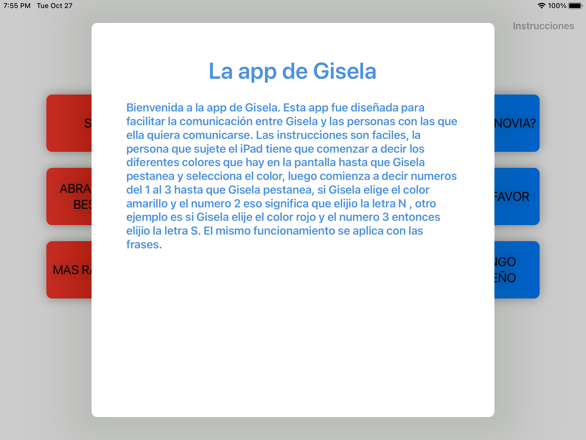

# GiseApp

I designed this app to help my aunt. She's had ALS for over a decade now and can't move any of her limbs and she can't speak either. She comunicates by blinking to certain letters and colors that her nurses say to her. She selects the letter and somehow (I dont know her method very well) forms words and sentences. 
She's been using my app for a couple of weeks now and finds it very helpfull, especially the part of the app that lets her say specific phrases. That saves her a great amount of time and is very helpfull when she needs to go to the bathroom or do something very quickyly.

## Main feature

- [x] Helps disabled people that can't move or speak to comunicate using a specific method explained in tha about section.

## Requirements

- iOS 13+
- Xcode 12

## Installation

Soon i'll be improving my app for it to work for anyone , not just my aunt.

## Screenshots

### Here is a screenshot of the part of the app that lets her say specific phrases.

### If she chooses not to say any of the phrases above and wants to say a specific word she can use this part of the app with a keyboard instead.

### Here are the instructions for the disabled person and their nurse.

